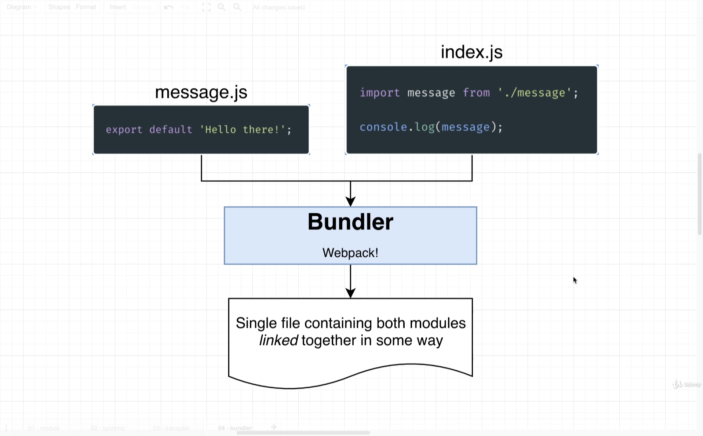

# Javascript modules

Javascript file that makes some values available to other files and/or consumes vaues from other files.

**message.js** provides a value

```js
export default "Hello there";
```

**index.js** consumes the value

```js
import message from "./message";
console.log(message);
```

### There are sevaral different module system available.

1. AMD
2. common js ( _require() and module.exports_ )
3. es modules ( _import and export_ )

---

Now we have the files , now how these values are actually exchanged between the files?.

> that is done by **Bundler**.

\
Take multiple different modules combine them all together and some how link them into a one single file, also be responsible to make sure that the value declared inside one module is communicated over to other module.



> Webpack doesnt work with the browser that well, so the solutions is to use **ESBuild**. ESbuild can **transpile** and **bundle** our code in all the browser.
