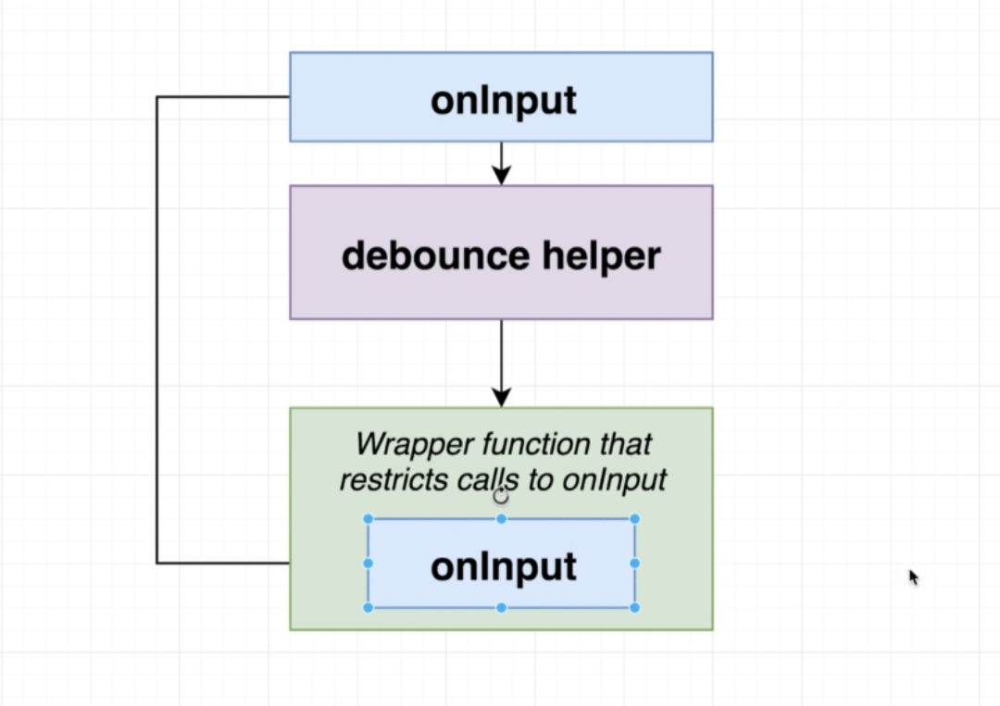
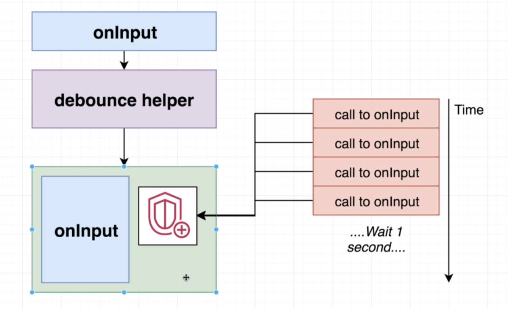

## Debounce

---

### this is a basice debounce function

> ```js
> let timerId;
> const handleInput = (event) => {
>   if (timerId) {
>     clearTimeout(timerId);
>   }
>   timerId = setTimeout(() => {
>     fetchData(event.target.value);
>   }, 500);
> };
> ```

## now how will we make it as a common helper function?

> **a debounce function will be a wrapper, which will return a function** > 

> ## The wrapper function is more like a shield
>
> 
