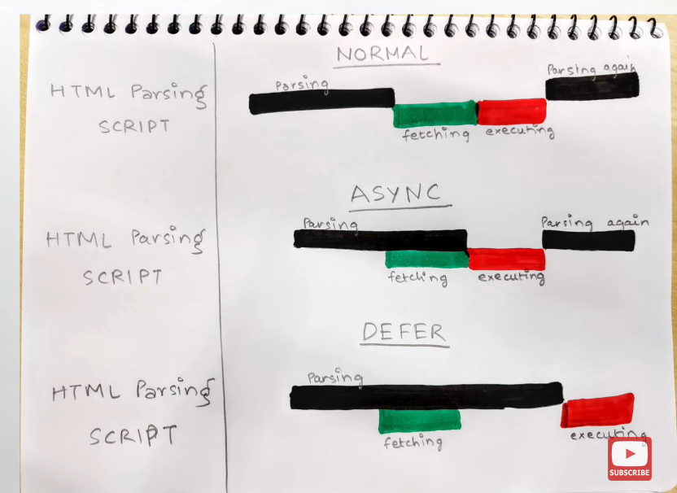

```js
typeof null; // "object" (not "null" for legacy reasons)
typeof undefined; // "undefined"
null === undefined; // false
null == undefined; // true
null === null; // true
null == null; // true
!null; // true

1 + undefined; // NaN
1 + null; // 1

//because of the above
//follows the below
Number.isNaN(1 + null); // false
Number.isNaN(1 + undefined); // true
```

1. ## primitive types

> - In JavaScript, primitive values are data types that are not objects and do not have properties or methods. They are immutable, meaning their values cannot be changed once they are created. JavaScript has six primitive types: undefined, null, boolean, number, string, and symbol.
> - Primitive values are directly stored in memory and have a fixed size, which makes them more efficient to store and manipulate compared to objects.
> - These primitive types are immutable, meaning their values cannot be changed once assigned. They are directly stored in memory and are compared by their value rather than by reference.
>
> <span style="color:aqua;font-size:15px">undefined:</span> Represents the absence of a value or an uninitialized variable.  
>  <span style="color:aqua;font-size:15px">null:</span> Represents the intentional absence of any object value.  
>  <span style="color:aqua;font-size:15px">boolean:</span>Represents a logical value of either true or false.  
> <span style="color:aqua;font-size:15px">number:</span> Represents numeric values, including integers and floating-point numbers.  
> <span style="color:aqua;font-size:15px"> string:</span>Represents a sequence of characters enclosed in single quotes ('') or double quotes ("").  
> <span style="color:aqua;font-size:15px">symbol:</span>Represents a unique and immutable value that can be used as an identifier for object properties. Symbols are often used for creating non-enumerable object properties.
>
> - Apart from the primitive types, JavaScript also has non-primitive types, commonly referred to as objects. Objects are composite values that can hold key-value pairs and have methods. They can be created using object literals, constructors, or classes. Examples of non-primitive types include:  
>    <span style="color:aqua;font-size:15px">Object:</span>The most basic non-primitive type in JavaScript. Objects are mutable and can hold properties and methods.  
>    <span style="color:aqua;font-size:15px">Array:</span>: A special type of object that represents an ordered list of values.  
>    <span style="color:aqua;font-size:15px">Function:</span>: A callable object that can be invoked and perform a specific task.
>   <span style="color:aqua;font-size:15px">Date:</span> Represents a specific moment in time.  
>    <span style="color:aqua;font-size:15px">RegExp:</span>Represents a regular expression, used for pattern matching within strings.  
>   <span style="color:aqua;font-size:15px">Map, Set, WeakMap, WeakSet:</span> Objects that provide specialized collections and data structures.

## 2. what is the difference between String and Object?

> 1. #### Strings are immutable
>    In JavaScript, when we say that strings are immutable, it means that once a string is created, its value cannot be changed. Any operation or manipulation on a string actually creates a new string rather than modifying the original one. The original string remains unchanged.
>
> ```js
> let myString = "Hello";
> // Attempt to modify the string
> myString[0] = "J"; // This will not change the string
> console.log(myString); // Output: "Hello" (original string is unchanged)
> ```
>
> ```js
> let originalString = "Hello";
> let modifiedString = originalString.toUpperCase();
>
> console.log(originalString); // Output: "Hello" (original >string is unchanged)
> console.log(modifiedString); // Output: "HELLO" (new modified string)
> ```

> 2. #### compared with value:
>    strings are compared with value, but objects are compared with reference / memory location.
> 3. #### Lack of explicit instantiation:
>    Unlike regular objects, strings do not require explicit instantiation using constructors or object literals. You can directly assign string literals to variables or use string manipulation methods without explicitly creating instances of the String object wrapper.  
>     we dont need to explicitly say , "hello there , this guy is a string"

---

## 3. what is <span style="color:aqua;font-size:15px">object literal</span>?

> In JavaScript, an object literal is a way to create and initialize an object using a concise syntax. It allows you to define key-value pairs, where the keys are strings (or identifiers) and the values can be any valid JavaScript expression.
>
> ```js
> const person = {
>   name: "John",
>   age: 25,
>   city: "New York",
>   isAdmin: false,
> };
> ```

---

### 4. Ways to create an object?

> 1. <span style="color:lime;font-size:15px">Object Literal Syntax:</span>
>
> ```js
> const person = {
>   name: "John",
>   age: 25,
>   city: "New York",
> };
> ```

> 2. <span style="color:lime;font-size:15px">Constructor Function:</span>
>
> ```js
> function Person(name, age, city) {
>   this.name = name;
>   this.age = age;
>   this.city = city;
> }
> const person = new Person("John", 25, "New York");
> ```

> 3. <span style="color:lime;font-size:15px">Object.create() method:</span>
>
> ```js
> const personProto = {
>   greeting: function () {
>     console.log("Hello!");
>   },
> };
>
> const person = Object.create(personProto);
> person.name = "John";
> person.age = 25;
> ```

> 4. <span style="color:lime;font-size:15px">ES6 Classes:</span>
>
> ```js
> class Person {
>   constructor(name, age, city) {
>     this.name = name;
>     this.age = age;
>     this.city = city;
>   }
> }
>
> const person = new Person("John", 25, "New York");
> ```

> 5. <span style="color:lime;font-size:15px">Factory Functions:</span>
>
> ```js
> function createPerson(name, age, city) {
>   return {
>     name: name,
>     age: age,
>     city: city,
>   };
> }
>
> const person = createPerson("John", 25, "New York");
> ```

---

## 5. What is deep copy and shallow copy?

> ### <span style="color:lime;">Shallow Copy:</span>
>
> - In JavaScript, a shallow copy refers to creating a new object or array that duplicates the top-level structure of the original object or array,<span style="color:orange;"> while still referencing the same nested objects or arrays.</span> In other words, a shallow copy only copies the values of the immediate properties or elements, but not the nested objects or arrays themselves.
> - A shallow copy is a copy of an object that only copies the object's properties. <span style="color:orange;">Any properties that are objects themselves are not copied, but rather a reference to the original object is stored in the new object.</span> This means that if you change a property of the original object, the change will be reflected in the new object.
>
> <span style="color:aqua;"> Ways to create a shallow copy:</span>
>
> 1. **Object.assign(target, source):** Creates a shallow copy of the source object into the target object.
> 2. **Spread syntax ({...}):** Creates a shallow copy of an object by spreading its properties into a new object.
>
> ```js
> const originalObj = { a: 1, b: 2, c: { d: 3 } };
> // Shallow copy using Object.assign()
> const shallowCopy = Object.assign({}, originalObj);
> originalObj.c.d = 4;
> console.log(shallowCopy.c.d); // Output: 4 (both objects are affected)
> ```

> ### <span style="color:lime;">Deep Copy</span>
>
> Deep copy creates a completely independent copy of an object and all of its nested objects or arrays. It means that any changes made to the original or copied object will not affect each other.
>
> <span style="color:aqua;"> Ways to create a deep copy:</span>
>
> 1. **JSON.parse(JSON.stringify(object)):** Creates a shallow copy of the source object into the target object.
> 2. **External lib, like lodash:** Creates a shallow copy of an object by spreading its properties into a new object.

---

## 6. Javascript is loosely typed (dynamically typed), what does that mean?

- In JavaScript, being loosely typed or dynamically typed means that variables are not bound to a specific data type. You don't need to declare the type of a variable explicitly, and the type of a variable can change dynamically during runtime.
- Type Inference: JavaScript infers the data type of a variable based on the assigned value. The type of a variable can change dynamically when a new value of a different type is assigned to it.

---

7. ## Memory Leak
   > - _**In programming, a memory leak occurs when a program unintentionally allocates memory but fails to release it when it is no longer needed. As a result, memory resources are consumed and not properly freed, leading to the accumulation of unused memory over time.**_

---

### 8. which means by using async await we are blocking the javascript main thread?

> No, using async/await does not block the JavaScript main thread. In fact, async/await is designed to work with asynchronous operations without blocking the main thread.
>
> When you use async/await, the await keyword suspends the execution of the async function, allowing other tasks on the main thread to continue running. While the function is waiting for the promise to resolve, it doesn't block the main thread but rather frees it up to perform other operations.
>
> In essence, await pauses the execution of the async function without blocking the main thread. It allows other code and events to be processed, making the application more responsive.

---

### async and defer.

## 

### Debouncing and Throtling

> In the context of JavaScript, throttling and debouncing are techniques used to control the execution of certain functions in response to frequent events like scrolling, resizing, or typing. Here's a brief explanation of each:

1. Throttling:

   - Throttling is a technique that limits the frequency at which a function is invoked. It ensures that the function is executed at a maximum rate, usually by setting a delay between consecutive invocations.
   - When an event occurs, the throttled function is called, and subsequent events within the throttling interval are ignored until the delay has elapsed. After the delay, the function can be invoked again with the next event.
   - Throttling is useful in scenarios where you want to limit the execution rate of a function to prevent it from being called too frequently, which can improve performance and prevent overload.

2. Debouncing:
   - Debouncing is a technique that postpones the execution of a function until after a specific period of inactivity. It groups multiple sequential events into a single invocation of the function.
   - When an event occurs, the debounced function is not immediately executed. Instead, a timer is started. If no further events occur within the specified time period, the function is finally invoked. If another event occurs before the timer elapses, the timer is reset.
   - Debouncing is useful when you want to handle events that may occur rapidly in succession but only need to respond to the final event or when you want to delay the execution of a function until the user has finished a particular action.

Both throttling and debouncing can be implemented using various JavaScript techniques, such as using timers (`setTimeout`, `setInterval`), event listeners, or specialized libraries. The specific implementation details may vary depending on the use case and the library or approach chosen.

In summary, throttling and debouncing are techniques used to control the frequency or timing of function execution in response to events, with throttling limiting the rate of execution and debouncing postponing execution until a period of inactivity.
