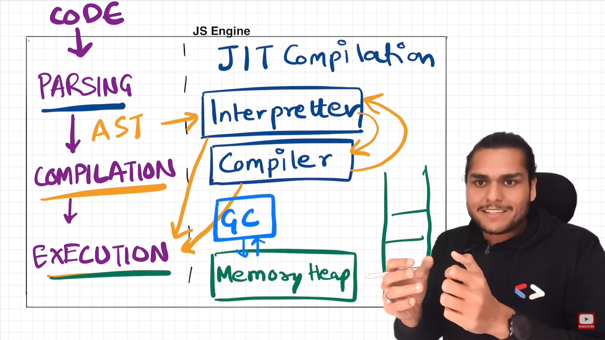

## JS engine

### JS runtime environment

> **its like a big container, which contains everything that is requied to run javascript code.**
>
> this includes
>
> 1. **_javascript engine_**
> 2. **_Web APIs_**
> 3. **_micro task queue and event queue_**

---

## js engine

> - _**A JavaScript engine is a program that executes JavaScript code.**_
> - _**It provides the necessary components to parse, interpret, compile, optimize, and execute JavaScript code efficiently.**_
> - _**The primary purpose of a JavaScript engine is to enable the execution of JavaScript in various environments, such as web browsers, servers, and standalone applications.**_
> - _**e.g: v8, spiderMonkey**_
>
> 
>
> - memory heap and call stack, garbage collector? are part of engine
> - The JavaScript engine, which consists of various components such as the parser, interpreter, just-in-time (JIT) compiler, and memory management subsystem, includes the garbage collector as an integral part. The garbage collector works closely with the memory heap to ensure efficient memory usage and prevent memory leaks.
>
> ### Garbage collector use Mark-and-Sweep algorithm to do the garbage collection.
>
> - The memory heap is a specific region of memory managed by the JavaScript engine. It is where objects and other dynamically allocated data structures are stored during the execution of a JavaScript program. The JavaScript engine handles the allocation and deallocation of memory within the memory heap as objects are created, modified, and destroyed.

---

#### A JavaScript engine consists of several key components that work together to execute JavaScript code efficiently. While the exact architecture may vary between different engines, the common elements found in most JavaScript engines include:

>  1.Parser: The parser analyzes the source code and converts it into an abstract syntax tree (AST) representation. It performs lexical analysis (tokenization) and syntactic analysis to understand the structure and grammar of the code.
>
>  2. AST Interpreter: The AST interpreter traverses the AST generated by the parser and executes the code sequentially. It interprets each node of the AST and performs the corresponding actions or computations.
>
> 3. Just-in-Time (JIT) Compiler: The JIT compiler is a key component of modern JavaScript engines. It optimizes the performance of JavaScript code by dynamically compiling parts of the code into highly efficient machine code. The JIT compiler identifies hotspots (frequently executed sections) in the code and generates optimized machine code specific to the target platform. This compilation process happens at runtime, hence the term "just-in-time."
>
>  4.Memory Heap: The memory heap is a region of memory managed by the JavaScript engine. It is responsible for allocating and deallocating memory for objects and data structures during the execution of a JavaScript program.
>
> 5.Call Stack: The call stack is a data structure that keeps track of the execution context of functions during the runtime of a JavaScript program. It stores information such as function calls, local variables, and the order in which functions are called. The call stack follows the Last-In-First-Out (LIFO) principle.
>
> 6. Garbage Collector: The garbage collector is responsible for automatic memory management in JavaScript. It scans the memory heap, identifies objects that are no longer reachable by the program, and reclaims the memory occupied by those objects. The garbage collector helps prevent memory leaks and ensures efficient memory usage.

### when will this JIT comes into picture?

> - As the interpreter executes the code, the JavaScript engine collects runtime information about the code's execution patterns. This information includes which functions are called frequently and which sections of code are executed repeatedly. This data helps identify hotspots, which are sections of code that are executed frequently and would benefit from optimization
>
> - Once the hotspots are identified, the JIT compiler comes into play. The JIT compiler selects specific portions of the code (usually hot functions or loops) and dynamically compiles them into highly optimized machine code. This compiled code is specific to the target platform and can significantly improve performance compared to the interpreted code.
>
> - After JIT compilation, the engine replaces the interpreted code of the hotspots with the compiled machine code. When the program execution encounters these hotspots again, the compiled code is executed directly, bypassing the interpreter. This improves the performance of the hotspots, as the compiled code is typically faster than the interpreted code.
>
> - Fall Back to Interpreter: Not all code is compiled by the JIT compiler. Some less frequently executed or more complex sections may still be executed using the AST interpreter. If the engine encounters code that hasn't been JIT-compiled, it falls back to the interpreter to execute that code.
