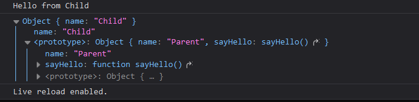

## Prototype

> - **In JavaScript, the prototype is an internal property of objects that is used for inheritance. Every object (except null) in JavaScript has a prototype.**
> - **The prototype is an object itself, and it serves as a blueprint or a template for creating new objects. It contains properties and methods that are shared among all instances created from it.**
> - <span style="color:lime;">**What about array?**</span>  
>   Arrays in JavaScript are special types of objects that have additional properties and methods specifically designed for working with ordered collections of data. Arrays inherit properties and methods from the Array.prototype object.
> - <span style="color:lime;">**What about functions?**</span>  
>    JavaScript functions are a special type of objects.They inherit properties and methods from the Function.prototype object.  
>   similarly NUMBER, STRING,DATE,RegExp are also special types of objects.

> - **Arrays:** Arrays in JavaScript are objects with special behavior for managing ordered collections of data. They have properties and methods specific to array manipulation, such as push(), pop(), slice(), and forEach().
> - **Functions:** Functions in JavaScript are objects that can be invoked and can have properties and methods. They have special characteristics, such as being callable and having a this value inside them. Function objects have methods like call(), apply(), and bind() for manipulating how they are invoked and setting their execution context.
> - **Strings:** String objects represent textual data and have properties and methods specific to string manipulation and transformation, such as charAt(), substring(), indexOf(), and toUpperCase().
> - **Numbers:** Number objects represent numeric values and have properties and methods for working with numbers, such as toFixed(), toPrecision(), toString(), and valueOf().
> - **Dates:** Date objects represent specific points in time and have methods for manipulating and formatting dates, such as getDate(), getMonth(), getFullYear(), and methods like toLocaleString() and toISOString().
> - **Regular Expressions:** Regular expression objects provide pattern matching and manipulation capabilities for working with strings. They have methods like exec(), test(), and toString() for matching and transforming strings based on patterns.

## prototypal inheritance

> **In JavaScript, objects can inherit properties and methods from other objects. This is achieved through a mechanism called prototypal inheritance. Every object in JavaScript has an internal link to another object called its prototype. When accessing a property or method on an object, JavaScript looks for that property or method in the object itself. If it doesn't find it, it continues to look for it in the object's prototype. This process continues up the prototype chain until the property or method is found or until it reaches the top-level object.**

> 

> **Check the above screenshot, In JavaScript's prototypical inheritance, the prototype of a child object will contain all the methods and properties defined in the prototype of its parent object.**

```js
// Parent object
const parent = {
  name: "Parent",
  sayHello() {
    console.log("Hello from " + this.name);
  },
};

// Child object inheriting from parent
const child = Object.create(parent);
child.name = "Child";

child.sayHello(); // "Hello from Child"
```

---

### when we add a function to the constructor , whenever we instantiate an object from that function thos instance will also get that greet() function, so what is the difference when we define it with prototype?

#### what exactly is the advantage?

```js
// Attaching a method directly to the constructor
function PersonWithMethod(name) {
  this.name = name;

  this.greet = function () {
    console.log("Hello, my name is " + this.name);
  };
}

// Attaching a shared method to the prototype
function PersonWithPrototype(name) {
  this.name = name;
}

PersonWithPrototype.prototype.greet = function () {
  console.log("Hello, my name is " + this.name);
};

var person1 = new PersonWithMethod("John");
var person2 = new PersonWithMethod("Jane");

var person3 = new PersonWithPrototype("Alice");
var person4 = new PersonWithPrototype("Bob");

console.log(person1.greet === person2.greet); // Output: false (different method instances)
console.log(person3.greet === person4.greet);
```
