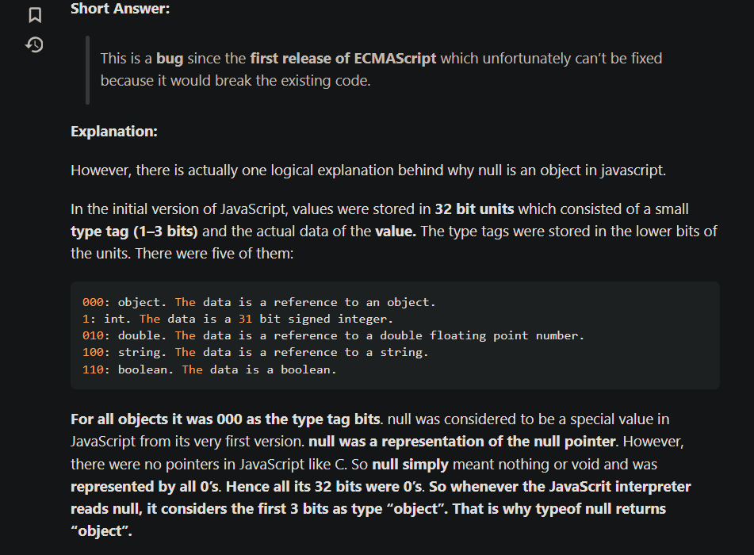

## Event bubbling and capturing

---

### Event Delegation

Event delegation in JavaScript is a technique where you assign a single event listener to a parent element instead of attaching individual event listeners to each child element. The parent element then handles events that are triggered by its children.

When an event occurs, it propagates through the DOM tree from the target element to its parent elements. Event delegation takes advantage of this event bubbling mechanism by capturing the event at a higher level in the DOM hierarchy.

Here's how event delegation works:

1. You select a parent element that will serve as the event listener container for its child elements. This parent element should already exist in the DOM when the code runs.

2. You attach a single event listener to the parent element, specifying the type of event you want to handle (e.g., click, mouseover, etc.).

3. When an event occurs on one of the child elements, it triggers the event listener attached to the parent element.

4. Inside the event listener, you can examine the event object to determine which specific child element triggered the event. You can access information such as the event target and event type to perform the desired actions.

Event delegation offers several benefits:

1. Efficiency: With event delegation, you attach only one event listener instead of multiple listeners to individual elements. This can improve performance, especially when dealing with a large number of child elements.

2. Dynamic content: If you dynamically add or remove child elements, you don't need to worry about attaching or detaching event listeners for each element. The parent element already has the event listener, so it automatically handles events on the new child elements.

3. Memory management: By having a single event listener instead of many, you avoid potential memory leaks caused by forgetting to remove event listeners when elements are removed from the DOM.

Overall, event delegation is a powerful technique that simplifies event handling and improves performance in certain scenarios, particularly when dealing with dynamically changing content.

# why type of null is object?

