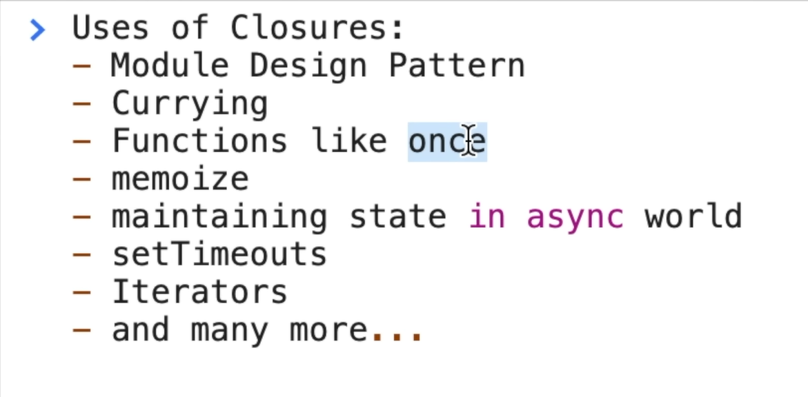

## Closure in JS

> ##### A closure is a combination of a function and its lexical scope.
>
> - **_A closure is a function that has access to variables from its surrounding scope, even after the surrounding function has finished executing. This is because the closure captures the values of those variables when it is created._**
> - **_In JavaScript, closures are created whenever a function is defined inside of another function. The inner function can then access any variables that are in scope in the outer function, <span style="color:lime;">even after the outer function has returned</span>._**
> - _**Closures are a powerful tool that can be used to solve a variety of problems. For example, they can be used to create reusable functions that can access data from other parts of the application. They can also be used to create asynchronous functions that can continue to work even after the main thread has finished executing.**_
>
> ```js
> function outer() {
>   var outerVar = "I am from outer";
>
>   function inner() {
>     console.log(outerVar); // Accessing outerVar from the >outer scope
>   }
>
>   return inner; // Returning the inner function
> }
>
> var closureFunc = outer(); // Assigning the returned inner >function to a variable
> closureFunc(); // Invoking the inner
> ```

> <span style="color:blue;">check example in code files</span>

### Closure Gotchas

> so when we say closure is a combination of a function and its lexical env,  
> <span style="color:orange;"> exact value of the private variable is not passed , instead closure contains the reference to that private variable.</span>

> 

## Currying

> _**Currying is a technique in JavaScript that allows you to transform a function with multiple arguments into a sequence of functions, each taking only one argument at a time. The curried function returns a new function for each argument until all the arguments are provided, and finally, it returns the result.**_
>
> ```js
> function multiply(a) {
>   return function (b) {
>     return a * b;
>   };
> }
>
> var multiplyByTwo = multiply(2);
> // Currying the multiply function with the first argument
> console.log(multiplyByTwo(4)); // Output: 8
> ```

## function that can only run once

> ```js
> function runOnce(fn) {
>   let hasRun = false;
>   let result;
>
>   return function () {
>     if (!hasRun) {
>       result = fn();
>       hasRun = true;
>     }
>
>     return result;
>   };
> }
>
> // Example usage:
> function expensiveOperation() {
>   console.log("Executing expensive operation...");
>   // Perform some expensive computation here
>   return "Result of expensive operation";
> }
>
> const runExpensiveOperationOnce = runOnce(expensiveOperation);
>
> console.log(runExpensiveOperationOnce()); // Output: Executing >expensive operation... Result of expensive operation
> console.log(runExpensiveOperationOnce()); // Output: Result of >expensive operation (cached result)
> ```

---

## setTimeout() and closures

> ```js
> function testClosure() {
>   let i = 100;
>   console.log("inside test CLosure fn");
>   setTimeout(() => {
>     console.log(i);
>   }, 2000);
>   i = 2023;
> }
>
> testClosure();
> // output is 2023;
> ```

### if we need to print 1 after 1 second 2 after 2 sec, 3 after 3 second and so on..

> ##### <span style="color:red;">This is wrong.</span>
>
> ```js
> function abc() {
>   for (var i = 0; i < 3; i++) {
>     setTimeout(() => {
>       console.log(i);
>     }, i * 1000);
>   }
> }
> abc();
> ```
>
> The variable i is declared using var. In JavaScript, variables declared with var have function-level scope, not block-level scope. That means there is only one i variable shared across all iterations of the loop. When the setTimeout callbacks execute, they reference the same i variable, which has a final value of 3 after the loop ends. As a result, all the callbacks log 3.

> #### <span style="color:lime;">One way to solve this is. replace <span style="color:aqua;">var</span> with <span  style="color:aqua;">let</span></span>
>
> - **_let will make it as global scope, and in each itteration the closure will be formed with a new copy of "i"_**
>
> ```js
> function abc() {
>   for (let i = 0; i < 3; i++) {
>     setTimeout(() => {
>       console.log(i);
>     }, i * 1000);
>   }
> }
> abc();
> ```
>
> The variable i is declared using let. Variables declared with let have block-level scope, meaning a new i variable is created for each iteration of the loop. Each setTimeout callback forms a closure, capturing the value of i at the time of creation. Therefore, when the callbacks execute, they log the respective values of i from each iteration: 0, 1, and 2.

### another approach without changing var

> - **_use closure, and supply a new copy of i,_**
>
> ```js
> function abc() {
>   for (var i = 0; i < 3; i++) {
>     function closure() {
>       setTimeout(() => {
>         console.log(i);
>       }, i * 1000);
>     }
>     closure(i);
>   }
> }
> abc();
> ```
