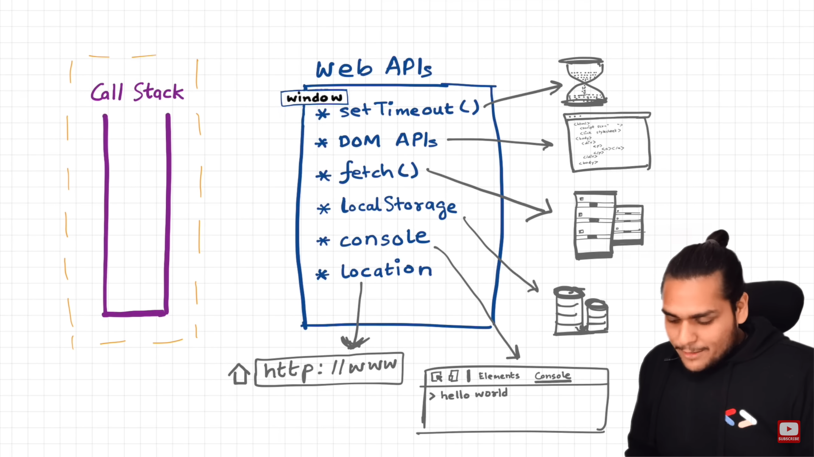
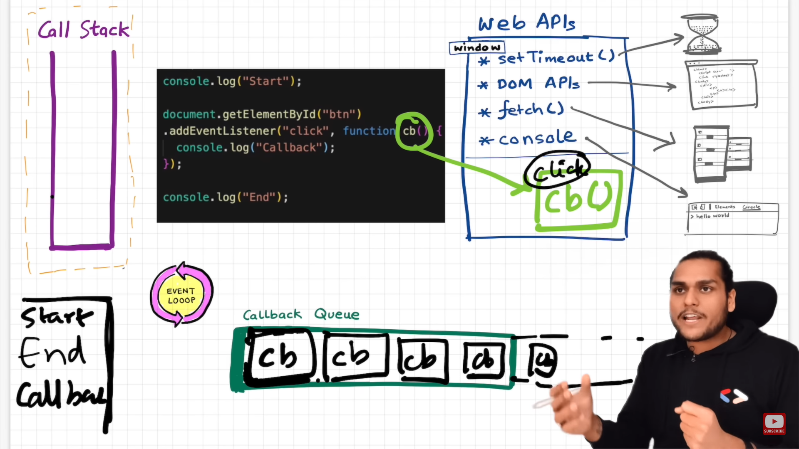
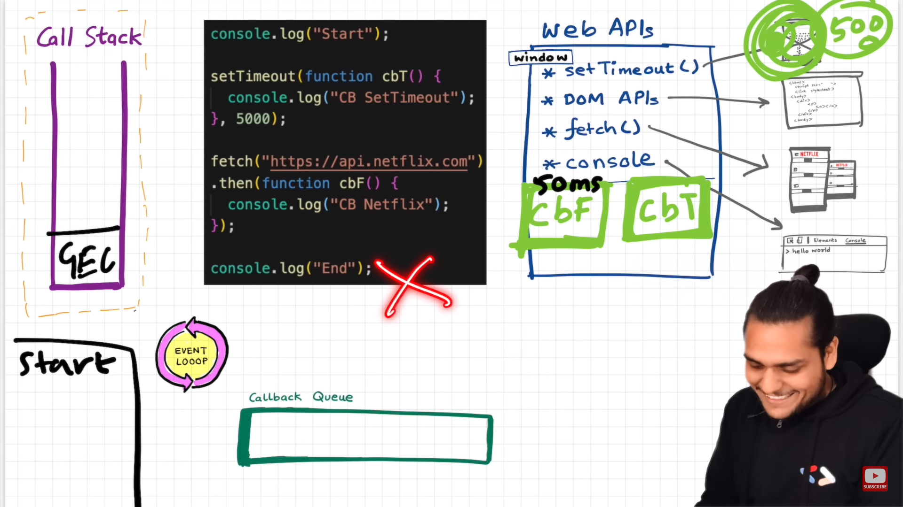
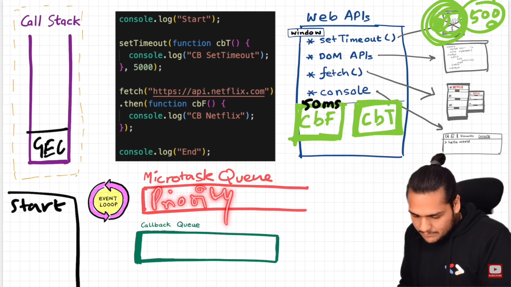
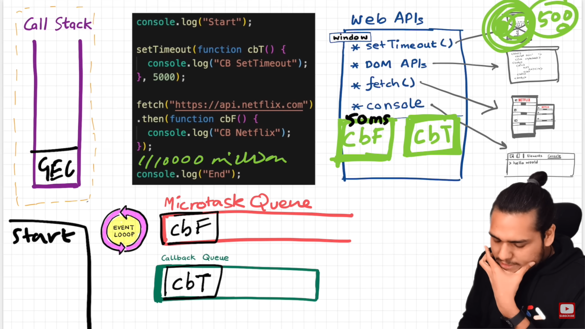

## Event loop

> - **_whenever any js program is run, a GEC is created and pushed to the callstack._**
> - **_Once it complete the execution, that GEC will also be popped out of the call stack._**
> - **_whenever js runtime encounters a function invocation, a new execution context is created for that function and and pushed to callstack. Upon completing that execution that particular execution context will be removed from the callstack._**

### 1. what exactly is the use of callstack?

> - call stack is essential for maintaining the execution order of function calls
>
> - The call stack is a data structure used by JavaScript to keep track of function calls during the execution of a program. It plays a crucial role in managing the flow of execution and maintaining the context of functions.
>
> - When a function is called, JavaScript creates a new frame (also known as an execution context) for that function and pushes it onto the call stack. This frame contains information such as the function's arguments, local variables, and the location in the code where the function was called from.

## JS engine

> 
>
> - **_we can access web API's through global object._**

---

    ## console.log() is not part of javascript language specification.?

> - console.log() is not part of the JavaScript language but is a built-in feature of the JavaScript runtime environment, both in web browsers and Node.js, for displaying output in the console.
> - console.log() is not part of the JavaScript language specification itself, it is provided by the host environment, whether it's a web browser or Node.js. The host environment exposes the console object, which includes various methods like log(), error(), warn(), and more, allowing you to output different types of messages or values to the console

> #### 1. for dom events, setTimeout etc how js works is same as in the picture.
>
> ie , callback function will be directly pushed to the event queue.
>
> ## but fot fetch it is different.
>
> 
>
> - fetch is a special case, OOps!
> - upon getting the response from the api, now callback function is ready to execute, but it wont get pushed to the **_event queue_**
> - instead it is pushed to another queue called Micro Task Queue which have higher priority
>
> ### Micro Task Queue:
>
> **_The microtask queue is a queue where microtasks are queued and processed by the JavaScript event loop. Microtasks are a type of asynchronous tasks that have higher priority than regular tasks and are executed before the event loop moves on to the next regular task._**
>
> 
>
> -

---

> **_Qn:_**
>
> ### **_which all events can go inside the micro task queue?_**
>
> 1. all the callback fn which come through promises will go inside the Micro Task Queue.
> 2. Callback related to Mutation Observer:
>
>    - The Mutation Observer is a JavaScript API that provides a way to react to changes in the DOM (Document Object Model). It allows you to observe and respond to changes made to the structure or content of an HTML document.
>    - The Mutation Observer is particularly useful when you need to monitor and react to dynamic changes in the DOM, such as when elements are added, removed, or modified. It provides a mechanism for detecting these changes and executing specified callback functions in response.

---

> **_Qn:_**
>
> ### **_What is starvation?_**
>
> starvation refers to a situation where a task or callback function is unable to execute because other tasks or events are continuously being processed, causing the starved task to be delayed or blocked indefinitely.
>
> when a micro task inturns generate another micro task which genetates another micro task , the task in the event queue will never get executed.
