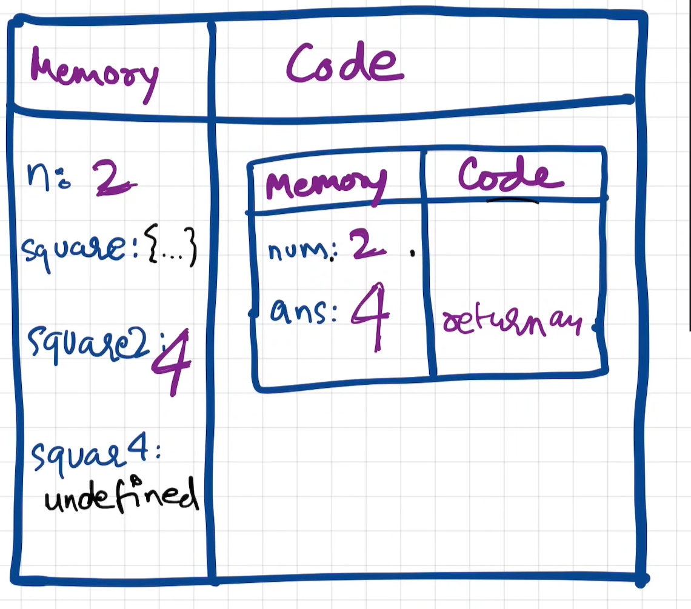

## How JS works?

> - **In JavaScript, everything happens within an execution context. An execution context is an environment in which JavaScript code is evaluated and executed.**
> - **An execution context is a data structure that holds all the necessary information for the execution of a specific piece of JavaScript code. It includes details such as variable declarations, function declarations, function parameters, and the value of the "this" keyword.**

> <span style="color:aqua;font-size:16px">Javascript is a synchronous single threaded language</span>
>
> 1.**Synchronous:** In JavaScript, synchronous execution means that code is executed line by line, in the order it appears in the program. Each statement must complete before the next one can be executed. This ensures that operations are performed in a predictable and sequential manner.
> When a JavaScript program is executed, the execution engine processes each statement one at a time, blocking the execution of subsequent statements until the current one finishes. This synchronous nature allows JavaScript to maintain the expected order of operations and produce deterministic results.
>
> **2.Single-threaded:** JavaScript is single-threaded, meaning it has a single execution thread for handling code execution. The code is processed sequentially, one statement at a time, from top to bottom. Only one operation can be executed at any given moment.

### Execution Context

> 

### How JS code is executed?

> - **again, when we run a js program an execution context is created**
> - consider the below example
>   
>
> - **So when we run this code a global execution context is created.**

- 

> 1.  **So when a JS code is executed, a global execution context will be created.**
> 2.  **and execution of the code happens in 2 phases**
>
>     1.  <span style="color:aqua">**memory creation phase:**</span> here javascript will go through the code line by line and assign a special value called undefined to variables. Functions should be assigned with the actual code (actual function block).
>     2.  <span style="color:aqua">**code execution phase**:</span>During this phase javascript started executing the code line by line, and those variables will get their actual values. Whenever there is a function invocation encounters , global context will pass the control to that function and then it will create <span style="color:lime">a new execution context</span> and it will follow the same memory allocation and code execution step. Once the function controll is given back to the global context the other execution context(used to execute the function ) will be removed.
>
> <span style="color:aqua">How javascript manages this creation and deletion of execution context?  
> </span> It manages this through a datastructure called
> <span style="color:lime">**Call stack.**</span>  
> **<span style="color:lime">_Call Stack</span> maintains the order of execution of execution context_**
>
> ```json
> call stack is also called as
> - Execution context stack
> - Program Stack
> - Control Stack
> - Runtime Stack
> - Machine Stack
> ```
>
> 
>
> - **whenever a js program is run, global execution context is first pushed inside a stack. - From there after new execution context are pushed to the stack. once that particular context done execution it is removed from the stack**
>
> - **once everything get executed call stack will be made empty**
