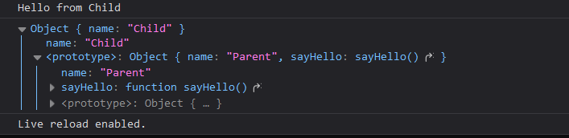

## Prototype

- In JavaScript, the prototype is an internal property of objects that is used for inheritance. Every object (except null) in JavaScript has a prototype.
- The prototype is an object itself, and it serves as a blueprint or a template for creating new objects. It contains properties and methods that are shared among all instances created from it.
- <span style="color:lime;">**What about array?**</span>  
  Arrays in JavaScript are special types of objects that have additional properties and methods specifically designed for working with ordered collections of data. Arrays inherit properties and methods from the Array.prototype object.
- <span style="color:lime;">**What about functions?**</span>  
   JavaScript functions are a special type of objects.They inherit properties and methods from the Function.prototype object.  
  similarly NUMBER, STRING,DATE,RegExp are also special types of objects.

> `__proto__` is the reference to the actual prototype object, and prototype (String.prototype) is the actual object where we can add methods and properties!

---

- **Arrays:** Arrays in JavaScript are objects with special behavior for managing ordered collections of data. They have properties and methods specific to array manipulation, such as push(), pop(), slice(), and forEach().
- **Functions:** Functions in JavaScript are objects that can be invoked and can have properties and methods. They have special characteristics, such as being callable and having a this value inside them. Function objects have methods like call(), apply(), and bind() for manipulating how they are invoked and setting their execution context.
- **Strings:** String objects represent textual data and have properties and methods specific to string manipulation and transformation, such as charAt(), substring(), indexOf(), and toUpperCase().
- **Numbers:** Number objects represent numeric values and have properties and methods for working with numbers, such as toFixed(), toPrecision(), toString(), and valueOf().
- **Dates:** Date objects represent specific points in time and have methods for manipulating and formatting dates, such as getDate(), getMonth(), getFullYear(), and methods like toLocaleString() and toISOString().
- **Regular Expressions:** Regular expression objects provide pattern matching and manipulation capabilities for working with strings. They have methods like exec(), test(), and toString() for matching and transforming strings based on patterns.

## prototypal inheritance

In JavaScript, objects can inherit properties and methods from other objects. This is achieved through a mechanism called prototypal inheritance. Every object in JavaScript has an internal link to another object called its prototype. When accessing a property or method on an object, JavaScript looks for that property or method in the object itself. If it doesn't find it, it continues to look for it in the object's prototype. This process continues up the prototype chain until the property or method is found or until it reaches the top-level object.



**Check the above screenshot, In JavaScript's prototypical inheritance, the prototype of a child object will contain all the methods and properties defined in the prototype of its parent object.**

```js
// Parent object
const parent = {
  name: "Parent",
  sayHello() {
    console.log("Hello from " + this.name);
  },
};

// Child object inheriting from parent
const child = Object.create(parent);
child.name = "Child";

child.sayHello(); // "Hello from Child"
```

---

### when we add a function to the constructor , whenever we instantiate an object from that function those instance will also get that greet() function, so what is the difference when we define it with prototype?

#### what exactly is the advantage?

```js
// Attaching a method directly to the constructor
function PersonWithMethod(name) {
  this.name = name;

  this.greet = function () {
    console.log("Hello, my name is " + this.name);
  };
}

// Attaching a shared method to the prototype
function PersonWithPrototype(name) {
  this.name = name;
}

PersonWithPrototype.prototype.greet = function () {
  console.log("Hello, my name is " + this.name);
};

var person1 = new PersonWithMethod("John");
var person2 = new PersonWithMethod("Jane");

var person3 = new PersonWithPrototype("Alice");
var person4 = new PersonWithPrototype("Bob");

console.log(person1.greet === person2.greet); // Output: false (different method instances)
console.log(person3.greet === person4.greet); // output true
```

---

### how to modify prototype?

To modify the prototype of an object or add new properties and methods to it, you can access the `prototype` property of the constructor function or the object itself and make changes to it. Here's an example:

```javascript
// Constructor function
function Person(name) {
  this.name = name;
}

// Adding a method to the prototype
Person.prototype.greet = function () {
  console.log(`Hello, my name is ${this.name}`);
};

// Creating an object
const john = new Person("John");

// Using the method defined in the prototype
john.greet(); // Output: Hello, my name is John
```

In this example, we define a constructor function `Person` that creates objects with a `name` property. We then modify the `prototype` of the `Person` constructor function to add a `greet` method. The `greet` method is shared among all objects created from the `Person` constructor.

By modifying the prototype, any existing or future objects created from the `Person` constructor will have access to the `greet` method. This allows for efficient code reuse and avoids duplicating the method for each object.

It's important to note that modifying the prototype affects all objects created from that constructor function. If you add or modify a property or method in the prototype, it will be reflected in all existing and future objects that inherit from it.

Keep in mind that modifying built-in prototypes (e.g., `Array.prototype`, `String.prototype`) is generally discouraged to avoid conflicts with other code. Modifying the prototypes of your own custom constructor functions is a common practice when implementing custom behavior and methods for your objects.

---

### Version2

## What is prototype?

In JavaScript, a prototype is an object that contains methods and properties that are shared by all objects that are created from a particular constructor function. For example, the Array constructor function has a prototype object that contains methods such as push(), pop(), and sort(). All arrays that are created using the Array constructor function inherit these methods from the prototype object.

Prototypes are used to implement inheritance in JavaScript. Inheritance is a way of reusing code and creating new objects that have the same properties and methods as existing objects. When you create a new object using a constructor function, the object inherits the properties and methods from the constructor function's prototype object.

---

## what is the difference between `prototype` and `__proto__` ?

- `prototype` is the actual prototype object which contains method and properties.
- where as `__proto__` is a reference to the prototype object.

#### note, just for my reference never mind.

if you are creating an object with a constructor function, we need to attach prototype

if we are creating an object from another object that parent object is attached as prototype.
