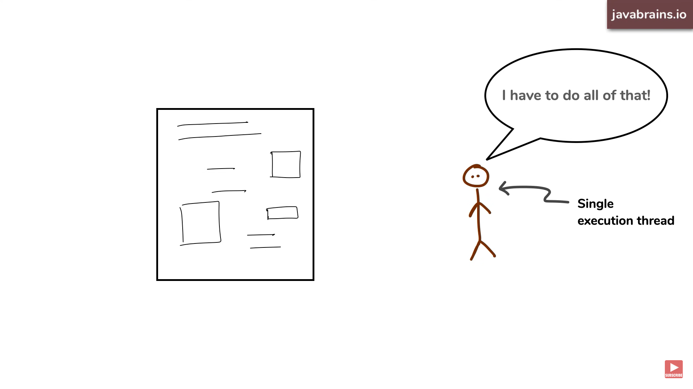
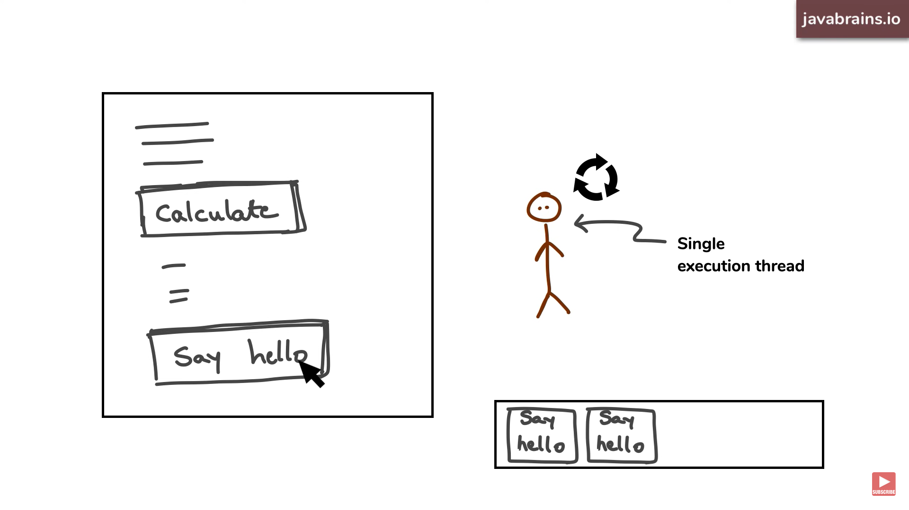
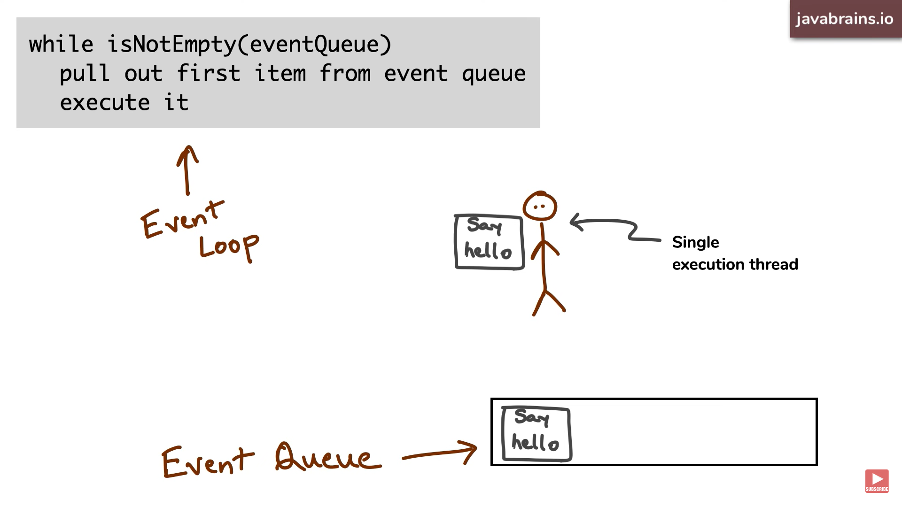
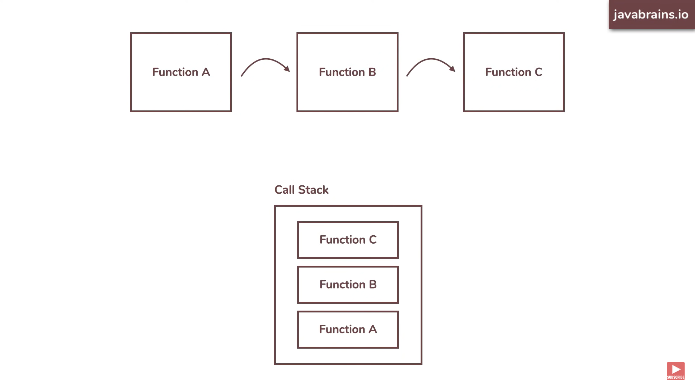
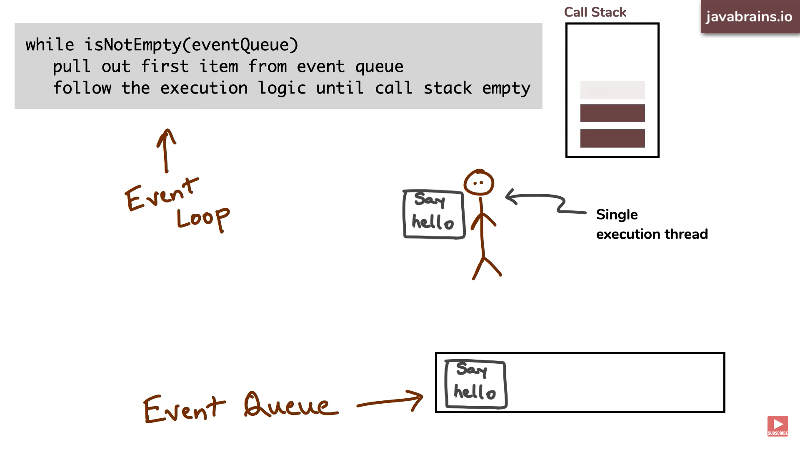

## Javascript event loop

- javascript is a combination of synchronous and asynchronous events.

#### Synchronous events

- Javascript is primarily **Single threaded**
- There is always only one thread that does all of the work that needs to happen in javascript runtime.
  

---

- say for example **single execution thread** is currently executing a task in a webpage.
- 
- say it is doing some calculations which will take time, now at the same time if user clicks say hello button 2 times its registers 2 events, that need to be handled by this same **single execution thread**.
- but the single execution thread will not stop what he is currenly doing, instead he will make a mental note of the events which he need to execute next.
- this is stored in a QUEUE and it is processed as FIFO
- This QUEUE is called **EVENT QUEUE**.
- upon completing the first task , thread will check the next task to be executed in the event queue.
  .

- whenever single execution thread done executing whatever it is executing, it will then check the event loop and start executing the next item. This will continues till the event queue is empty.
- This is like a loop where thread continuosly checking the event queue to what to execute next.
  ;
- #### this loop is called **EVENT LOOP**.

---

## Now what is it doing in execute step.

- it will execute a function
- it depends on if it is a synchronous or asynchronous function.
- ### asynchronous function

  > - if the function is an asynchronous function, then the thread need to wait till that function completes the execution.
  > - say for example thread pics up an event that calls a function which calls another function, which inturn calls another function,
  >   
  >
  > - this is managed by a dataStructure called
  >   **call stack** > 

  ## How event loop and call stack are connected?

  > - The event loop is a JavaScript concept that allows the browser to handle multiple events at the same time. It is responsible for managing the execution of JavaScript code and ensuring that it is executed in a timely manner.
  > - The call stack is a data structure that stores the current state of execution of a JavaScript program. It contains a list of functions that are currently being executed, as well as the arguments that were passed to each function.
  > - The event loop and the call stack work together to ensure that JavaScript code is executed in a smooth and efficient manner. When a JavaScript event occurs, it is added to the event queue. The event loop then checks the event queue to see if any events are waiting to be processed. If there are any events, the event loop will remove the first event from the queue and execute it.
  > - When an event is executed, it may call other JavaScript functions. These functions are added to the call stack. The event loop will continue to execute events until the call stack is empty. Once the call stack is empty, the event loop will check the event queue again to see if any more events are waiting to be processed.
