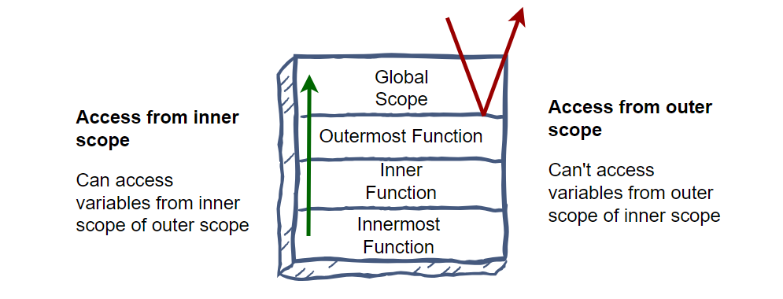

## what is lexical scope

Lexical scope is the ability for a function scope to access variables from the parent scope. We call the child function to be lexically bound by that of the parent function.

