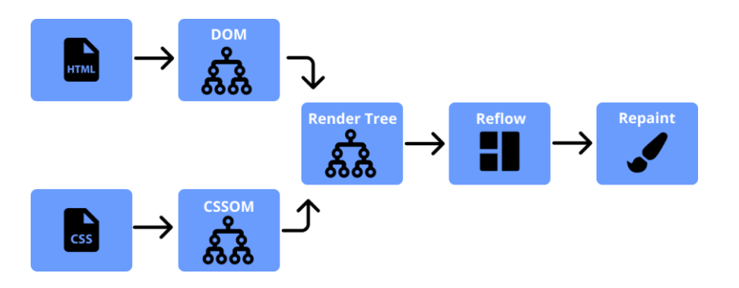

# Critical rendering path

[md link]("https://developer.mozilla.org/en-US/docs/Web/Performance/Critical_rendering_path")

Critical rendering path explains the series of path the browser will follows inorder to convert HTML, CSS and JS into pixels on the screen

Steps involved in Critical rendering paths are

1. Crearing the DOM
2. Creatinf the CSS Object Modal (CSSOM)
3. creating the render tree
4. creating the layout
5. paint
