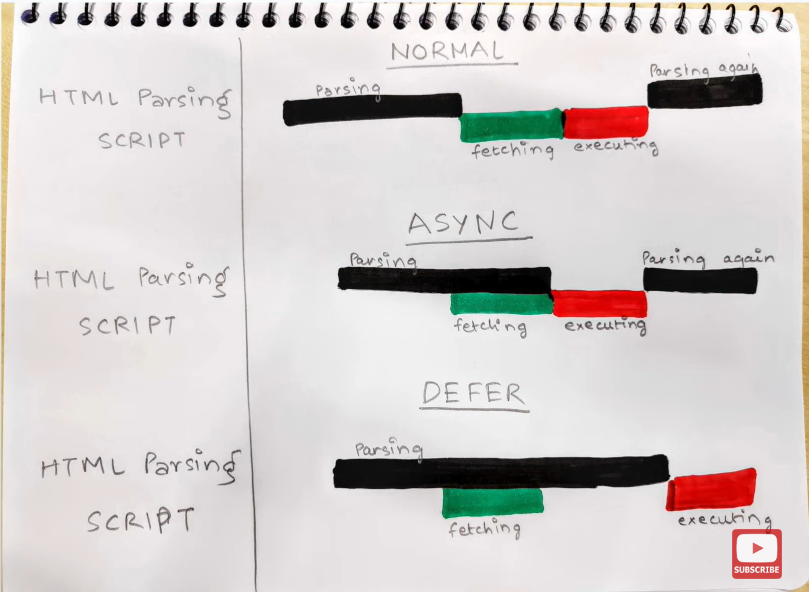

# Events

## 1. What are events in Javascript?

JavaScript is meant to add interactivity to your pages: the user does something and the page reacts.
When the user does something an event takes place. There are also some events that aren’t directly caused by the user: the load event that fires when a page has been loaded, for instance.

Events are the things that happens in the system you are programming.The system produces a signal of some kind when an event occurs.

Event can be something the browser does, or something a user does.  
Here are some examples of HTML events:

- An HTML web page has finished loading
- An HTML input field was changed
- An HTML button was clicked

To react to an event, you attach an event handler to it. Which is block of code that runs when that even occurs. When such a block of code is defined to run in response to an event, we say we are **registering an event handler**. **Event handlers** are sometimes called **event listeners**.

removing an event listener with AbortController();

```javaScript
const controller = new AboutController();
btn.addEventListener("click",() => {
    console.log("clicked");
    },
    {signal: controller.signal}
    )
// we can remove the event listener
//removes any/all event handlers associated with this controller
controller.abort();

```

The target/srcElement properties contain a reference to the HTML element the event originally took place on. Very useful, but when the event is captured or bubbles up the target/srcElement doesn’t change: it’s still the element the event originally took place on.

## addEventListener()

Attaches event handlers to the target.
Target can be

- Element and its children
- document
- window

> Note: Many event targets (including elements, documents, and windows) also support setting event handlers via onevent properties and attributes.

addEventListener allows adding more than one handler for an event.
but if a particular anonymous function is in the list of event listeners registered for a certain target, and then later in the code, an identical anonymous function is given in an addEventListener call, the second function will also be added to the list of event listeners for that target.

Indeed, anonymous functions are not identical even if defined using the same unchanging source-code called repeatedly, even if in a loop.

```javaScript
addEventListener(type, listener)
addEventListener(type, listener, options)
addEventListener(type, listener, useCapture)
```

## DOM event flow

#### If an element and one of its ancestors have an event handler for the same event, which one should fire first?


There are two ways this can be configured

- Event on element1 takes place first is called **event capturing**
- Event on element2 takes place first is called **event bubbling**

**Event capturing**  


When we use event capturing the event handler of element1 firse first, and then event in element2

**Event bubbling**  


When we use event bubbling the event handlers of element2 fires first then element1

**W3C Model**  
Any event taking place in the W3C event model is **first captured** until it reaches the target element and **then bubbles** up again.

> Note: The W3C (World Wide Web Consortium) is an international organization that creates standards for the World Wide Web. The WC3 is committed to improving the web by setting and promoting web-based standards.


Web developer, can choose whether to register an event handler in the capturing or in the bubbling phase. This is done through the addEventListener() method. If its last argument is **true** the event handler is set for the **capturing phase**, if it is **false** the event handler is set for the **bubbling phase**.

```javascript
element1.addEventListener("click", doSomething2, true);
element2.addEventListener("click", doSomething, false);
```

If the user clicks on element2 the following happens:

1. The click event starts in the capturing phase. The event looks if any ancestor element of element2 has a onclick event handler for the capturing phase.
2. The event finds one on element1. doSomething2() is executed.
3. The event travels down to the target itself, no more event handlers for the capturing phase are found. The event moves to its bubbling phase and executes doSomething(), which is registered to element2 for the bubbling phase.
4. The event travels upwards again and checks if any ancestor element of the target has an event handler for the bubbling phase. This is not the case, so nothing happens.

**It always happens**  
What you first need to understand is that event capturing or bubbling always happens. If you define a general onclick event handler for your entire document, any click event on any element in the document will eventually bubble up to the document and if there is any general event attached it will fire this general event handler. Only when a previous event handling script explicitly orders the event to stop bubbling, it will not propagate to the document.

**Turning it off**  
But usually you want to turn all capturing and bubbling off to keep functions from interfering with each other. Besides, if your document structure is very complex (lots of nested tables and such) you may save system resources by turning off bubbling. The browser has to go through every single ancestor element of the event target to see if it has an event handler. Even if none are found, the search still takes time.

In the W3C model you must call the event’s stopPropagation() method.

```js
e.stopPropagation();
```

This stops all propagation of the event in the bubbling phase.

**Event delegation**  
Event delegation is a technique in JavaScript where we delegate the responsibility of handling an event to a parent element. By doing so, we avoid attaching multiple event listeners to individual elements, especially when dealing with a large number of similar elements, such as a list or a table.

---

## what is "DOMContentLoaded" event, how is it different from "load" event?

The **DOMContentLoaded** event is fired when the HTML document has been completely parsed, and all diferred scripts

```html
<script defer src="…">
    or
<script type="module">
```

have downloaded and executed.  
It doesn't wait for other things like images, subframes, and async scripts to finish loading.

But in the case of **load** event, the event is fired when the whole page has loaded, including all dependant resources such as **stylesheets, scripts, iframes, and images.** This is in contrast to DOMContentLoaded, which is fired as soon as the page DOM has been loaded, without waiting for resources to finish loading.

## What is the difference between async and defer?

Async and defer are boolean attributes which are used along script tag inorder to load the external scripts efficiently.

- when we load a webpage 2 major things happen,
  1. HTML parsing
  2. Loading the scripts
- loading the scripts contians 2 pars

  1. fetching the script from the network
  2. executing the script line by line

- this loading the script behaviour changes based on the async or defer attribute which we provide

**case 1: normal case**

```html
<script src="">
```

- in the normal case when a webpage is loaded, it starts to parse the HTML content of that webpage,
- but when the browser encounters a `script` tag it stops the HTML parsing at that point and then fetch the script from the server, and then it will start executing the script.
- After executing the script , Browser will continue prsing the HTML content
- bottom line is **browser pauses the HTML parsing for a while**, scripts will block the rendering

**case 2: using async attribute**

```html
<script src="" async>
```

- in the case of async attribute, HTML parsing will happen, and when the browser encounters a script tag with async attribute it will fetch the script from the server parallely.**it wont block the parsing**
- but the moment the script is fetched, it will stop the HTML parsing and the execute the script which is being loaded.

- after executing the script , Browser will continue parsing the HTML content

**case 3: using defer attribute**

```html
<script src="" defer>
```

- in the case of defer attribute, HTML parsing will go on, and when the browser encounters any script tag that is fetched in parallel.
- even after loading the external script, HTML content will continue to parse.
- once the HTML is parsed , then the loaded script is executed,
- **basically no blocking of HTML**



**When to use what?**

> note : async attribute doesnt guarantee the order of execution of the script, the one which is loaded first is executed first.  
> But differ does gurantee the order of execution of the script

- if the scripts are dependent, its better to use defer, because it will gurantee the order
