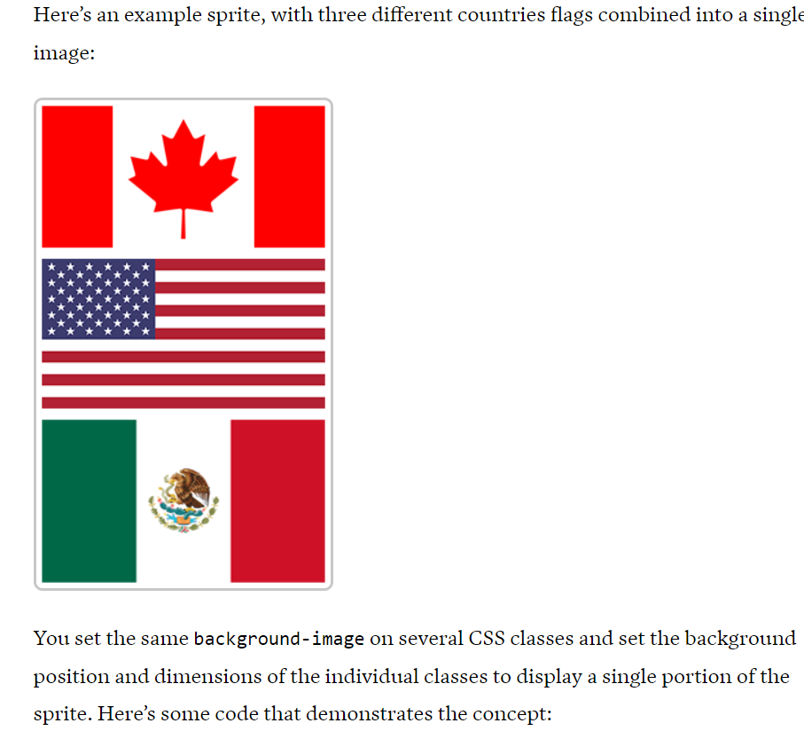

## Optimizing CSS

Showing users an unstyled page and then repainting it after the CSS styles have been parsed would be a bad user experience. For this reason, CSS is render blocking until the browser determines that the CSS is required. The browser can paint the page after it has downloaded the CSS and built the CSS object model (CSSOM).

### **Optimizing rendering**

---

**To optimize the CSSOM construction** and improve page performance, you can do one or more of the following based on the current state of your CSS:

1. **Remove unnecessary styles:** All styles get parsed, whether they are being used during layout and painting or not, so it can speed up page rendering to get rid of unused ones.

2. **Split CSS into separate modules:** Keeping CSS modular means that CSS not required at page load can be loaded later on, reducing initial CSS render-blocking and loading times. The simplest way to do this is by splitting up your CSS into separate files and loading only what is needed

```html
<!-- Loading and parsing styles.css is render-blocking -->
<link rel="stylesheet" href="styles.css" />

<!-- Loading and parsing print.css is not render-blocking -->
<link rel="stylesheet" href="print.css" media="print" />

<!-- Loading and parsing mobile.css is not render-blocking on large screens -->
<link
  rel="stylesheet"
  href="mobile.css"
  media="screen and (max-width: 480px)"
/>
```

The above example provides three sets of styles —

- default styles that will always load,
- styles that will only be loaded when the document is being printed,
- styles that will be loaded only by devices with narrow screens.`

> note: When the browser sees a style sheet that it only needs to apply in a specific scenario, `it still downloads the stylesheet, but doesn't render-block`.

> **media attribute in link tag:** This attribute specifies the media that the linked resource applies to. Its value must be a media type / media query. This attribute is mainly useful when linking to external stylesheets — it allows the user agent to pick the best adapted one for the device it runs on.

3. **Minify and compress your CSS:** Minifying involves removing all the whitespace in the file that is only required for human readability.You can reduce loading times considerably by minifying your CSS. Minification is generally done as part of a build process

4. **Simplify selectors:** People often write selectors that are more complex than needed for applying the required styles. This not only increases file sizes, but also the parsing time for those selectors. For example:

```css
/* Very specific selector */
body div#main-content article.post h2.headline {
  font-size: 24px;
}

/* You probably only need this */
.headline {
  font-size: 24px;
}
```

5. **Don't apply styles to more elements than needed:** A common mistake is to apply styles to all elements using the universal selector, or at least, to more elements than needed. This kind of styling can impact performance negatively, especially on larger sites.

```css
/* Selects every element inside the <body> */
body * {
  font-size: 14px;
  display: flex;
}
```

6. **Cut down on image HTTP requests with CSS sprites:** combining multiple images into a single image and loads that single image, instead of fetching multiple images. The large image is then used with appropriate background position property to show the required image.



```css
.flags-canada,
.flags-mexico,
.flags-usa {
  background-image: url("../images/flags.png");
  background-repeat: no-repeat;
}

.flags-canada {
  height: 128px;
  background-position: -5px -5px;
}

.flags-usa {
  height: 135px;
  background-position: -5px -143px;
}

.flags-mexico {
  height: 147px;
  background-position: -5px -288px;
}
```

7. **preload important assets:** You can use `rel=preload` to turn link elements into preloaders for critical assets. This includes css files, fonts, images. With preload, the browser will fetch the referenced resources as soon as possible and make them available in the browser cache so that they will be ready for use sooner when they are referenced in subsequent code. It is useful to preload high-priority resources that the user will encounter early on in a page so that the experience is as smooth as possible.

   ```html
   <link rel="preload" href="style.css" as="style" />
   ```

### **Handling animations**

Animations increase UX, but large number of animations will degrade the performace. So it is better to cut down unnecessary animations

For essential animation, use CSS animation instead of javascript animation

**Choosing properties to animate**  
 it is important to choose the right properties to animate, Certain properties when animated will trigger a `reflow`. (and therefore also a `repaint`) and should be avoided.
such properties are

- altering an elements dimensions: width, height, border, padding
- repositioning an element: margin top bottom left right
- changing an elements layout: align-content , align-item flex
- visual effects that changes elements geometry: box-shadow

if at all possible animate propertes that wont trigger a reflow

- transform
- opacity
- filter

**We can move certain animations to the gpu, which imporves the performance**

### **Optimizing element changes with will-change**

---

will-change property hints the browser how an element is expected to change. With this info , browser can do some optimization.

```css
.element {
  will-change: opacity, transform;
}
```

### **Improving font performance**

Using multiple fonts will have an impact on loadtime, and therefore there will be a performance hit

**font loading**

> Bear in mind that a font is only loaded when it is actually applied to an element using the font-family property, not when it is first referenced using the @font-face at-rule:

```css
/* Font not loaded here */
@font-face {
  font-family: "Open Sans";
  src: url("OpenSans-Regular-webfont.woff2") format("woff2");
}

h1,
h2,
h3 {
  /* It is actually loaded here */
  font-family: "Open Sans";
}
```

It can therefore be beneficial to `use rel="preload"` to load important fonts early, so they will be available more quickly when they are actually needed:

```html
<link
  rel="preload"
  href="OpenSans-Regular-webfont.woff2"
  as="font"
  type="font/woff2"
  crossorigin
/>
```

> font files are quite large, and if you preload too many of them, you may delay other resources.

Although preload is highly effective at making fonts discoverable early in the page load process, this comes at the cost of taking away browser resources from the loading of other resources.

- Using `rel="preconnect"` to make an early connection with the font provider.

The `preconnect` keyword for the rel attribute of the <link> element is a hint to browsers that the user is likely to need resources from the target resource's origin, and therefore the browser can likely improve the user experience by **preemptively initiating a connection to that origin.** Preconnecting speeds up future loads from a given origin by preemptively performing part or all of the handshake (DNS+TCP for HTTP, and DNS+TCP+TLS for HTTPS origins).

```html
<head>
  <link rel="preconnect" href="https://fonts.com" />
  <link rel="preconnect" href="https://fonts.com" crossorigin />
</head>
```
