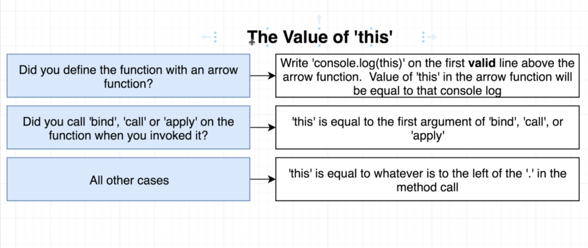

#### using this keyword inside a button event listener will not give you the object, instead it will refer to the button.

#### so we need a work around for this.

## value of this inside a method.



---

## is sayHello.call() and sayHello() same in js?

> No, `sayHello.call()` and `sayHello()` are not the same in JavaScript.

The `sayHello()` function is a regular function call where the function is invoked without any explicit context. It executes the function in the current context or the global context (in the case of the browser, it would be the `window` object).

For example:

```javascript
function sayHello() {
  console.log("Hello!");
}

sayHello(); // Output: "Hello!"
```

On the other hand, `sayHello.call()` is a method provided by JavaScript Function objects. The `call()` method is used to invoke a function with a specific context or object as the first argument. The subsequent arguments are the function's parameters.

For example:

```javascript
function sayHello() {
  console.log("Hello, " + this.name + "!");
}

const person = {
  name: "John",
};

sayHello.call(person); // Output: "Hello, John!"
```

In the above example, the `sayHello.call(person)` statement invokes the `sayHello()` function with the `person` object as the context (`this`). Inside the `sayHello()` function, `this.name` refers to the `name` property of the `person` object, resulting in the output "Hello, John!".

Using `call()`, you can explicitly set the context (`this`) for a function and pass arguments individually.

In summary, `sayHello()` is a regular function call, while `sayHello.call()` is a method that allows you to invoke a function with a specified context using the `call()` method.

---

### what is the difference between bind , call and apply in javascript functions?

> In JavaScript, the `bind`, `call`, and `apply` methods are used to manipulate how a function is invoked and to control the context (`this` value) and arguments passed to the function. Here's a breakdown of the differences between these methods:

1. `bind`: The `bind` method creates a new function with a specified context (`this` value) and potentially pre-set arguments. It does not immediately invoke the function but returns a new function that can be invoked later.

> `bind wont invoke immediately, and it can only receive one argument.`

```javascript
function sayHello() {
  console.log("Hello, " + this.name + "!");
}

const person = {
  name: "John",
};

const sayHelloToJohn = sayHello.bind(person);
sayHelloToJohn(); // Output: "Hello, John!"
```

In this example, `bind` is used to create a new function `sayHelloToJohn` with the `person` object as the context. When `sayHelloToJohn` is invoked, it prints "Hello, John!" because the context is set to `person`.

2. `call`: The `call` method immediately invokes a function with a specified context (`this` value) and individual arguments passed as separate parameters.

> `call  invoke immediately, and it can only receive one argument.`

```javascript
function sayHello() {
  console.log("Hello, " + this.name + "!");
}

const person = {
  name: "John",
};

sayHello.call(person); // Output: "Hello, John!"
```

Here, `call` is used to invoke the `sayHello` function with the `person` object as the context. It directly executes the function and prints "Hello, John!".

3. `apply`: The `apply` method is similar to `call`, but it accepts an array or array-like object as the second parameter to pass arguments to the function.

> apply invoke immediately, and it can receive multiple argument.

```javascript
function sayHello() {
  console.log("Hello, " + this.name + "!");
}

const person = {
  name: "John",
};

sayHello.apply(person); // Output: "Hello, John!"
```

In this example, `apply` is used to invoke the `sayHello` function with the `person` object as the context. The function is immediately executed, and it prints "Hello, John!".

`apply` can also accept an array of arguments to pass to the function:

```javascript
function sayHello(firstName, lastName) {
  console.log("Hello, " + firstName + " " + lastName + "!");
}

const person = {
  name: "John",
};

sayHello.apply(person, ["Alice", "Smith"]); // Output: "Hello, Alice Smith!"
```

Here, the `apply` method is used to pass the array `["Alice", "Smith"]` as individual arguments to the `sayHello` function.

To summarize, `bind` creates a new function with a bound context, `call` immediately invokes a function with a specified context and individual arguments, and `apply` immediately invokes a function with a specified context and an array of arguments.

---

## `this` is interesting, when it come to class methods

#### arrow functon inside the class will be converted to some other format and will be redefined inside the constructor

```js
class Timer {
  // constructor is a function which get called automatically >whenever we create a new instance of the class.
  constructor(durationInput, startButton, pauseButton) {
    this.durationInput = durationInput;
    this.startButton = startButton;
    this.pauseButton = pauseButton;
    console.log("inside constructor");
    // this.startButton.addEventListener("click", this.start);
  }
  start = () => {
    console.log("inside start");
    console.log(this);
  };

  stop = () => {
    console.log("this is stop func");
  };
}
```

#### the above class will be converted to the below, so that every browser can understand. this will be the actual code that is executed inside a browser.

```js
class Timer {
  // it is guaranteed that inside constructor this refers to the class itself.
  constructor(durationInput, startButton, pauseButton) {
    // here this is going to be the valid line
    console.log(this); // this refers to the class itself.
    _defineProperty(this, "start", () => {
      console.log("inside start");
      console.log(this);
    });
    _defineProperty(this, "stop", () => {
      console.log("this is stop func");
    });
    this.durationInput = durationInput;
    this.startButton = startButton;
    this.pauseButton = pauseButton;
    console.log("inside constructor");
    // this.startButton.addEventListener("click", this.start);
  }
}
```

### In this case this will get a value which is the parent's this, that is the instantiated object itself.
